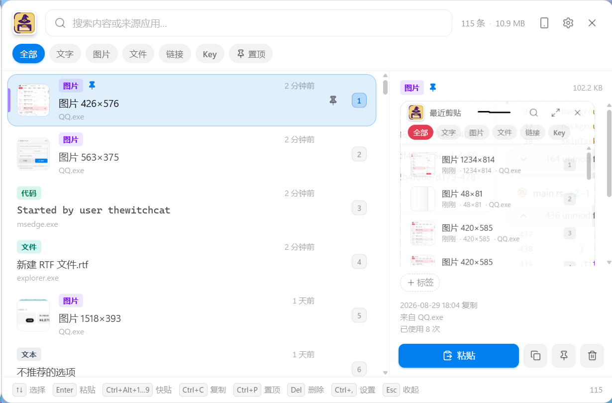
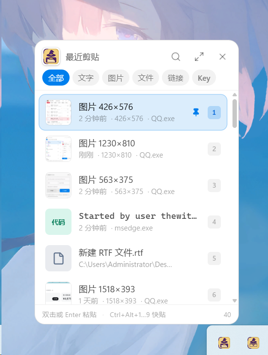

<p align="center">
  <a href="./README.md">简体中文</a> · English
</p>

<p align="center">
  
</p>

<h1 align="center">Witch Clipboard</h1>

<p align="center">
  <b>A local-first clipboard manager for Windows</b><br />
  Lives in the tray, pops up a preview on click, <code>Alt+V</code> for the full panel<br />
  Auto categorization, source-app search, related-item groups, local encryption and end-to-end encrypted sync
</p>

<p align="center">
  <a href="https://github.com/witchscottishfoldcat/Witch-Clipboard/releases/latest">Download latest</a>
  ·
  <a href="./CHANGELOG.md">Changelog</a>
  ·
  <a href="https://www.witchcat.cn">Author's site</a>
  ·
  <a href="https://www.witchcat.cn/zh/support">Sponsor ❤</a>
</p>

<p align="center">
  
  
</p>

<p align="center">
  <sub>Left: full panel (<code>Alt+V</code>), right: mini preview panel (click the tray icon)</sub>
</p>

Things you copied shouldn't vanish into a clipboard that only remembers the last item. That's what this
project does: keep everything you've ever copied and let you find it again within three seconds. History
stays on your machine by default: the database is encrypted with SQLCipher, images are encrypted with
AES-256-GCM, and the master key is protected by the OS secure storage. LAN transfer only runs when you
turn it on and never goes through a cloud; WebDAV history is encrypted on the client before upload —
the server never sees your clipboard plaintext.

## What it does

| | |
| --- | --- |
| **Auto capture** | Text, images (screenshots) and files are stored automatically; copying the same content again floats it up instead of duplicating it |
| **Two panels** | Single-click the tray for the mini preview (280×390), `Alt+V` for the full panel (820×540) |
| **Auto categories** | Text / image / file / link / key / model / code / color / path / email / number, each with its own badge |
| **Source search** | Search content and filter by source app — type `msedge` to see only what you copied from the browser |
| **Related groups** | Model names, keys and endpoints copied within 5 seconds are grouped automatically, up to 5 shown, collapsible |
| **Custom navigation** | Pick which category tabs show at the top in settings; stays lean by default |
| **Chinese search** | FTS5 trigram tokenizer searches Chinese substrings; 1–2 character terms fall back to a scan |
| **LAN transfer** | Phone scans a QR code, PC confirms the device, then they connect; text, images and files flow both ways with chunked uploads, progress, cancel and resume |
| **Encrypted cloud sync** | Sync history through any WebDAV-compatible server; state and images are end-to-end encrypted with AES-256-GCM on the client |
| **Files & big files** | Only the path is recorded, never the content — copying a 10 GB video library adds one row; pasting yields the real file |
| **Paste back** | `Enter` switches back to the previous window and simulates `Ctrl+V`; global quick-paste keys paste the top nine items directly |
| **Organize** | Pin (never auto-cleaned), tags, filter by type/tag, full keyboard control |
| **Themes & accents** | System / light / dark themes, seven accent colors applied to every button |
| **Local encryption** | SQLCipher database + AES-256-GCM images, keys protected by OS secure storage |
| **Auto cleanup** | Keep by count / age, orphan image files recycled too |
| **Privacy** | Clipboards flagged "don't record" (password managers) and blacklisted apps never get stored |

## Install / Run

Grab it from [Releases](https://github.com/witchscottishfoldcat/Witch-Clipboard/releases/latest):

- Windows x64: `Witch-Clipboard-<version>-x64-setup.exe`
- Windows ARM64: `Witch-Clipboard-<version>-arm64-setup.exe` (experimental)
- Windows x64/ARM64 portable: `Witch-Clipboard-<version>-<arch>-portable.zip` (unpack and run)

Windows installers use NSIS with an optional install location; uninstalling keeps your data. Official
releases target Windows only; artifacts you build yourself land in `src-tauri/target/<target>/release/bundle/nsis/`.

Run from source:

```bash
npm install
npm run dev          # dev mode (the panel shows itself)
npm run selftest     # Rust/Tauri core tests
npm run selftest:system-clipboard # real E2E that explicitly touches the system clipboard
npm run typecheck    # type checking
npm run build        # build the Tauri app
npm run dist         # Windows x64 NSIS installer
npm run dist:win:arm64
npm run dist:win:all # build Windows x64 / ARM64 at once
npm run dist:win:portable # Windows x64 portable
npm run dist:win:arm64:portable # Windows ARM64 portable
npm run icons        # regenerate icons
```

**Requirements**: developing needs Node 22+, Rust stable, Visual Studio C++ Build Tools and WebView2.
Windows x64 is the primary supported platform; Windows ARM64 is an experimental build for now.

## Keyboard shortcuts

| Key / action | Effect |
| --- | --- |
| **Click tray icon** | Pops the **mini preview panel** (next to the tray icon), click again to collapse |
| Double-click tray icon | Open the full panel directly |
| Right-click tray icon | Mini panel / full panel / collapse all / quit |
| `Alt+V` | Toggle the full panel (global, remappable in settings) |
| Just type | Search |
| `↑` `↓` / `PgUp` `PgDn` / `Home` `End` | Move the selection |
| `Enter` | Paste the selected item into the window you just left |
| `Ctrl+Alt+1…9` | Globally paste the top 9 items in any window; modifiers remappable in settings, digits `1…9` fixed |
| `Ctrl+C` | Copy to the clipboard only, no paste |
| `Ctrl+P` | Pin / unpin |
| `Del` | Delete |
| `Ctrl+,` | Open settings (may get swallowed by the IME when a Chinese input method is active; use the gear button) |
| `Esc` | Clear the search first, then collapse the panel |

## Two panels

- **Mini preview panel** (click the tray): 280×390, shows roughly the last 8 items in one screen. Text shows
  its first line, images a thumbnail, files name + size + folder. Typing searches instantly, `↑↓` selects,
  `Enter` / double-click pastes; the global quick-paste keys default to `Ctrl+Alt+1…9` with modifiers
  remappable in settings; the arrow in the top-right expands into the full panel.
- **Full panel** (`Alt+V`): 820×540 with the filter bar, tag editing, full-size image preview, item details
  and action buttons.

Both windows share the same renderer bundle; `?mode=mini` switches the layout.

**Hides when you click away**: when focus leaves the panel (desktop, another app, Alt+Tab) it hides
automatically. While developing, use `WCC_NO_AUTOHIDE=1 npm run dev` to keep the panel pinned.

## Cross-device clipboard

Click the phone button in the top-right of the full panel to enable it:

- The PC temporarily starts a LAN service and shows a random QR code; scan it with any mobile browser, no app needed
- After the phone requests a connection the PC must explicitly confirm the device; nothing can be read or uploaded before that
- Once connected the PC's current clipboard shows immediately; whichever item you select in the PC list is sent to the phone
- Text, images and files transfer in both directions; content from the phone is written back to the PC clipboard and history
- Files are chunked at 256 KB with progress and cancel; uploads resume via a stable transfer ID and `.part` files, downloads support HTTP Range resume
- The QR code expires the moment you close the connection; no third-party server is involved
- Keys, tokens and passwords are refused by default; text is capped at 100 KB, images at 20 MB, single files at 2 GB

This is a LAN convenience feature, not an end-to-end encrypted internet sync service. Only enable it on Wi‑Fi you trust.

## End-to-end encrypted WebDAV history sync

Fill in the WebDAV URL, username and app password in settings to enable it. The first save generates a
dedicated 256-bit sync key; copy that key to your other devices, then sync manually — while enabled it
also syncs in the background every 5 minutes.

- History state, tags, deletion records and images are all encrypted on this machine with AES-256-GCM before upload over HTTPS
- Every image blob is encrypted and SHA-256 verified individually; remote file names derive from the sync key and leak no content hash; concurrent writes use ETag conditional requests to detect conflicts and retry automatically
- WebDAV credentials and the sync key are encrypted again on disk with the master key; the public config API only returns "is set" and a key fingerprint
- Deletions propagate between devices via tombstones; newer re-copies can explicitly restore content
- The server still sees a fixed directory name, ciphertext sizes, file counts and access times, but never content, tags or source apps

The sync key cannot be recovered from the server. Lose the key and the cloud history is undecryptable;
be careful copying it — other clipboard tools may record that too. Plaintext HTTP WebDAV is refused
except for local tests.

## Search, navigation and related groups

- The search box matches content, tags and source apps at once; type `msedge` to see only browser copies
- The top navigation shows all, text, image, file, link and key by default; model, code, color, path,
  email and number tabs can be enabled in settings as needed
- Items copied within 5 seconds count as one group; the detail pane shows up to 5 related items; the link icon expands or collapses them
- Groups don't depend on content type, so a model name, a key, a URL and a plain note can share a group

## Files and large files

Copying files (Ctrl+C in Explorer) stores a `files` entry:

- **Only the path is recorded, content is never copied** — copying a 10 GB video adds a single row of path
- The UI shows file name, size and containing folder; the folder icon locates it in Explorer
- Pasting writes a real `CF_HDROP`, so what lands is **the file itself** (paste it straight into WeChat or
  Explorer), not a path string. If the native write fails it falls back to writing the path text — it never
  silently does nothing
- If the file is moved or deleted the entry remains and the path is stale — that's "clipboard history"
  semantics, not a file manager

## Auto updates

GitHub Releases is the source, **everything requires your click**:

- The "About & updates" page in settings has a **check for updates** button showing the current version,
  reporting results honestly (up to date / new version / why it failed / not supported in dev mode)
- One automatic check 12 seconds after launch; failure or timeout stays silent
- Finding a new version only shows a hint — no auto-download, no silent install on quit
- Downloading requires clicking "download update", installing requires clicking "restart and install"
- Clicking **"not now"** remembers that version and never nags about it again on launch; a manual check
  still reports honestly and won't lie "already latest" just because you skipped it

The Tauri updater verifies an independent signature on release artifacts; whether Windows Authenticode is
available depends on whether the release repo has a code-signing certificate configured. The two signatures
serve different purposes, and missing either one will never be documented as "signed".

## Where data lives

`%APPDATA%\WitchCat-Clipboard` (the settings page has an "open data folder" button):

| File | Contents |
| --- | --- |
| `clipboard.db` | SQLCipher-encrypted database: entries, tags, thumbnails, full-text index |
| `blobs/<first 2>/<sha256>.bin` | AES-256-GCM encrypted full images, content-addressed, auto-deduplicated |
| `master.key` | Master key, protected by Windows DPAPI |
| `webdav-sync.secret` | Locally encrypted WebDAV credentials, switch and end-to-end sync key |
| `settings.json` | UI and behavior settings, plaintext |

Upgrading from the old version (when it was called ZTB) automatically migrates data from `%APPDATA%\ztb`;
it only copies, never deletes.

## Logo

<p>
  
  &nbsp;&nbsp;
  
</p>

The left one is the main icon, the right one the tray-sized version of the same artwork. The icon uses a
warm gold base, thick deep-purple outlines and a lightly beveled frame, with a "wizard hat + clipboard" motif.

| | |
| --- | --- |
| Base | Warm gold gradient over a deep-purple backplate; same visual family as WitchDrawer |
| Clipboard | Cream-gold board, thick deep-purple outline, three content lines |
| Wizard hat | Deep-purple gradient with a gold band that doubles as the clipboard's top clip |

The design master is a high-fidelity PNG; the app icon and tray sizes are all scaled from it:

| File | Purpose |
| --- | --- |
| `resources/logo-rendered.png` | Official raster master; in-app and per-platform icons derive from it |
| `resources/logo.svg` / `logo-tray.svg` | Early vector drafts, kept as design records only |
| `resources/icon.png` / `icon-256.png` / `icon.ico` | App icon, Windows installer icon, README |
| `resources/tray.png` / `tray@2x.png` | Tray icons from the same master (`nativeImage` picks the hi-dpi one via the `@2x` convention) |

After replacing the master run `npm run icons` to regenerate; the shipped app never bundles a browser runtime.

## Tech stack

Tauri 2 · Rust · React 19 · TypeScript 7 · Tailwind CSS 4 · Vite 7 ·
sqleet/SQLite · AES-256-GCM · windows-sys · NSIS

```
src-tauri/   Rust backend: windows, tray, hotkeys, clipboard, encrypted storage, LAN service, updater commands
src/         React UI (App = full panel, MiniApp = mini panel)
scripts/     Performance benchmarks, system-clipboard E2E and icon maintenance scripts
```

### A few key trade-offs

- **Clipboard listening**: Rust polls Win32 `GetClipboardSequenceNumber` to detect changes. That call is
  dirt cheap, so 400ms polling costs almost no CPU while idle — no decoding clipboard content every tick.
  Falls back to content-fingerprint comparison when the native API is unavailable.
- **Search** uses FTS5 with the `trigram` tokenizer. The default `unicode61` can't split Chinese, so Chinese
  substrings were unfindable; trigram can, but its minimum is 3 characters, so 1–2 character keywords fall
  back to an escaped `LIKE` scan.
- **Images** are content-addressed: `blobs/<first 2 of hash>/<hash>.bin`, one copy per unique image.
  The database only holds thumbnails; full images are decrypted on demand.
- **Encryption**: the master key is 32 random bytes, wrapped to disk with Windows DPAPI in a
  `safeStorage`-compatible envelope; the database uses SQLCipher, images use AES-256-GCM, each derived
  from different subkeys.
- **The data directory is pinned to one name**: always `%APPDATA%\WitchCat-Clipboard`, so an upgrade never
  reads two databases.
- **`safeStorage` on Windows is not bound to the user account alone**: its encryption key lives in the
  profile's `Local State` file (itself DPAPI-protected). So "change the data directory" equals "change to a
  random key", and a migrated `master.key` won't decrypt — a migration must carry `Local State` along too.
  This one was learned the hard way during the rename; you won't think of it until you've been bitten.
- **"Hide on click-away" can't rely on the `blur` event alone**: when summoned from the tray, Windows'
  foreground-window preemption limits can leave the window visible but never focused, so it never blurs and
  the panel never disappears no matter what you click. So besides blur, a watchdog asks the system every
  200ms "which process owns the foreground window" and collapses when it isn't ours.
  The critical safety condition is **only allowed to hide after confirming we once held the foreground** —
  otherwise "never won focus" gets misread as "the user clicked away" and the panel vanishes on its own.
  These branches are all asserted in `npm run selftest`.
- **The clipboard file list is handled directly by Rust**: read via `OpenClipboard` + `DragQueryFileW`,
  written with `GlobalAlloc` + `DROPFILES`.
  On capture, files are judged **before text** — Explorer often attaches a path text alongside copied files,
  and checking text first would record "copied a video" as a plain string.
- **There's a tray-click race that must be handled**: clicking the tray icon first collapses the panel via
  focus loss, and only then does the `click` event arrive. Without the "just collapsed, ignore this click"
  cooldown, clicking the tray to dismiss the panel makes it pop right back up, forever uncollapsible.
  This invariant is guaranteed by `toggleFromTray()` itself and asserted in the self-test.
- **Auto-paste** simulates keystrokes via Win32. Before sending Ctrl+V it releases lingering modifiers,
  otherwise the Alt you're holding from `Alt+V` makes the target app receive Ctrl+Alt+V.
- **When the database won't open** (lost master.key, switched Windows account, corrupted data) it never
  silently overwrites or creates an empty one; the app reports the error clearly and keeps the original data.

## Verification

`npm run selftest` runs the Rust/Tauri core tests; `npm run selftest:system-clipboard` explicitly covers the
real system path for HTML, images, `CF_HDROP` and auto-paste. Before releases, type checking and
per-arch packaging also run.

Manually verified end-to-end paths: text/image/file auto capture, auto-paste into Notepad (Chinese
included), an external process reading pasted content back as real files, the packaged app running
normally, the panel disappearing when focus leaves.

## Security boundaries (honest notes)

- The encryption defends against "someone got your db file and reads it directly". The master key is
  protected by the current system account's secure storage; malware running under the same account can
  still read it — this is not an anti-malware mechanism.
- Sensitive content is skipped based on two things: clipboard flags like `ExcludeClipboardContentFromMonitorProcessing`
  (mainstream password managers set them) and a source-process blacklist. **Not 100% reliable**: content
  copied by apps that set no flag and aren't blacklisted still gets stored. Don't treat it as a DLP mechanism.
- Uninstalling keeps the data directory; to wipe completely, delete `%APPDATA%\WitchCat-Clipboard` manually.

## Platform support and known limitations

| Platform | Status | Notes |
| --- | --- | --- |
| Windows 10/11 x64 | **Officially supported** | Full listening, source detection, auto-paste, file clipboard, tray and update capabilities |
| Windows 11 ARM64 | **Experimental** | Native ARM64 installers provided; native dependencies and common flows need more real-device testing |

- **Win11 may tuck the tray icon into the "overflow" area**, making it invisible and unclickable. Fix:
  right-click taskbar → Taskbar settings → System tray icons → Other system tray icons → enable Witch
  Clipboard. While the icon is overflowed `tray.getBounds()` returns 0; the program falls back to
  "pop up near the cursor" and logs a warning.
- `Ctrl+,` to open settings may be swallowed by the IME when a Chinese input method is active; use the gear button.
- The Tauri x64 NSIS installer is currently about 3.18 MB; it depends on the system WebView2, and offline
  machines without WebView2 need the runtime installed first.
- A hidden panel releases its WebView, about 14 MB while idle in the tray; showing the panel still spawns
  multiple WebView2 processes.

## Version history

See [CHANGELOG.md](./CHANGELOG.md).

## Support development

Witch Clipboard is maintained in the author's spare time — free and ad-free. If it has helped you,
consider [sponsoring](https://www.witchcat.cn/zh/support); every bit of support keeps development going.

## Developer & license

- Author: Thewitchcat
- Email: witchscottishfoldcat@gmail.com
- Website: [www.witchcat.cn](https://www.witchcat.cn)
- Repository: [witchscottishfoldcat/Witch-Clipboard](https://github.com/witchscottishfoldcat/Witch-Clipboard)
- License: [PolyForm Noncommercial 1.0.0](https://polyformproject.org/licenses/noncommercial/1.0.0)

You may use it for any noncommercial purpose (personal study, research, entertainment, hobby projects,
etc.); redistribution must include this license or a link to it and keep author attribution. For commercial
use, contact the author for separate authorization first.
